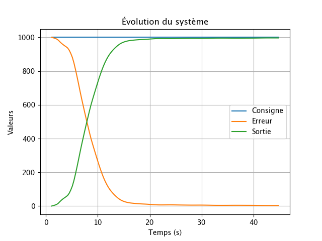

# Projet SYS866 : Contrôle PID par Apprentissage par Renforcement
## Auteurs : Céline Nguyen, Erwan Audousset, Robert Antaluca, Romain Lemaire

Ce ReadMe décrit les étapes pour installer et exécuter notre projet de contrôle PID .

Nous vous conseillons d'executer ce projet sur un Mac ou Linux pour une meilleure compatibilité avec le MATLAB Engine python sur lequel repose la simulation.

## Installation du MATLAB Engine pour Python

### Prérequis
- MATLAB 2025 installé
- Python 3 installé et accessible dans le terminal

### Librairies Python nécessaires
Installer les librairies python nécessaires :

```sh
pip install numpy
pip install torch
pip install matplotlib
```

### macOS et Linux

1. Ouvrir un terminal.
2. Se rendre dans le dossier :
```sh
cd /Applications/MATLAB_R20XXx.app/extern/engines/python
```
Il faut remplacer `R20XXx` par la version de MATLAB installée (par exemple, `R2024a`, `R2025a`).

3. Installer avec :
```sh
python3 setup.py install
```
### Windows

1. Ouvrir CMD ou PowerShell.
2. Se rendre dans le dossier :
```sh
cd "C:\Program Files\MATLAB\R20XXx\extern\engines\python"
```
(Il faut remplacer `R20XXx` par la version de MATLAB installée, par exemple, `R2024a`, `R2025a`).
3. Installer avec :
```sh
python setup.py install
```
4. Créer le dossier suivant à la racine  : "C:\temp"

5. Il faut ensuite utiliser le fichier `sys866_lib_windows.py` à la place de `sys866_lib.py` dans les scripts python du projet (voir lignes commentées dans les fichiers que vous souhaitez exécuter).

### La simulation MATLAB peut maintenant s'exécuter dans le code Python 

## Essayer le code

Pour éxécuter un épisode avec l'une des politiques implémentées vous pouvez lancer au choix les scripts suivants dans le terminal à la racine du projet :

#### Politique P2: 

```sh
python3 main_P2.py
```

#### Politique AC (Actor-Critic):

```sh
python3 main_Actor_Critic.py
```
#### Politique VFA

```sh
python3 main_VFA.py
```

## Entraîner la politique Actor-Critic
Pour entraîner la politique Actor-Critic, lancez le script suivant dans le terminal à la racine du projet :

```sh
python3 train_Actor_Critic.py
```

## Évaluer la politique Actor-Critic entraînée
Pour évaluer la politique Actor-Critic entraînée, lancez le script suivant dans le terminal à la racine du projet :

```sh
python3 eval_Actor_Critic.py
```

### Remarques pour l'exécution ( Mac/Linux et Windows)
- Assurez-vous que MATLAB est installé et que le MATLAB Engine pour Python est correctement configuré avant d'exécuter les scripts.
- Si vous utilisez Windows, n'oubliez pas de modifier les imports dans les scripts Python pour utiliser `sys866_lib_windows.py` à la place de `sys866_lib.py`.
- Les scripts sont configurés pour utiliser la simulation MATLAB nommée `Simulation_simulink_Mac` par défaut. Si vous êtes sous Windows, décommentez la ligne correspondante et commentez celle pour Mac dans les scripts.
- Assurez-vous que le dossier "C:\temp" existe si vous utilisez Windows, car le MATLAB Engine pour Python l'utilise pour stocker des fichiers temporaires.

### Structure des fichiers
- `sys866_lib.py` : Bibliothèque pour interfacer Python avec la simulation MATLAB (Mac/Linux).
- `sys866_lib_windows.py` : Bibliothèque pour interfacer Python avec la simulation MATLAB (Windows).
- `Actor_Critic_policy.py` : Implémentation de la politique Actor-Critic.
- `VFA_policy.py` : Implémentation de la politique VFA.
- `main_P2.py` : Script principal pour exécuter un épisode avec la politique benchmark P2.
- `main_Actor_Critic.py` : Script principal pour exécuter un épisode avec la politique Actor-Critic.
- `main_VFA.py` : Script principal pour exécuter un épisode avec la politique VFA.
- `train_Actor_Critic.py` : Script pour entraîner la politique Actor-Critic.
- `eval_Actor_Critic.py` : Script pour évaluer la politique Actor-Critic entraînée.

- `eval_logs/`: Dossier contenant les logs d'évaluation des politiques.
- `models/`: Dossier contenant les modèles Actor-critic entraînés.
- `plots/`: Dossier contenant les graphiques des performances des politiques sur les épisodes d'évaluation.
